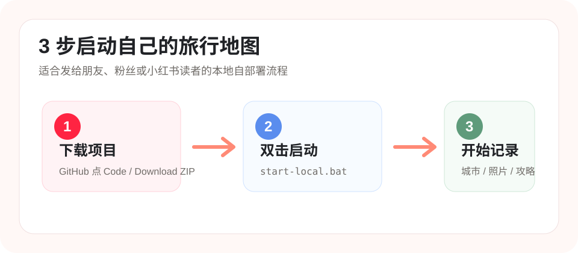
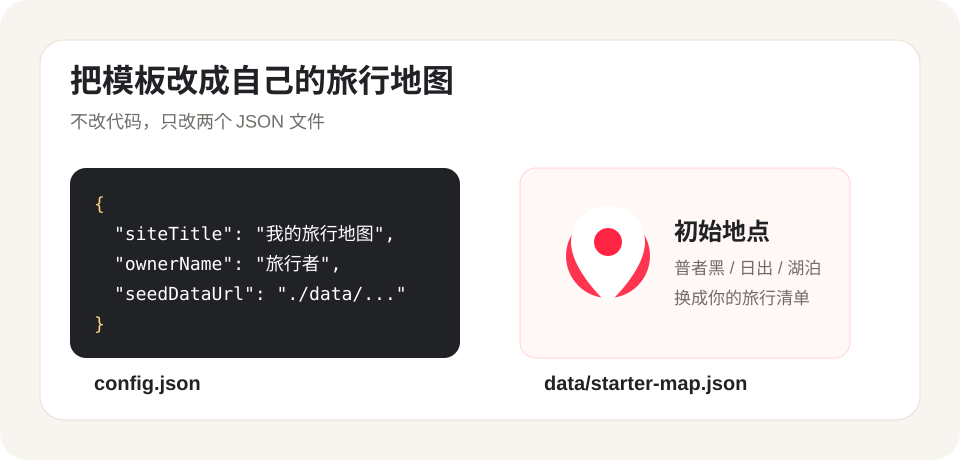

# 山河小记

把去过、想去、正在计划的地方做成一张自己的旅行地图。适合记录城市、照片、攻略、标签、预算、路线和可分享的旅行主页。



## 适合谁

- 想把旅行笔记做成地图主页的人。
- 想 fork 一份项目，部署成自己个人旅行地图的人。
- 想在小红书分享“可自部署旅行地图模板”的创作者。
- 不想先搭后端，只想本地记录和静态部署的人。

## 最快开始：本地一键启动

### Windows 用户

1. 打开 GitHub 项目页，点击 `Code`。
2. 选择 `Download ZIP`。
3. 解压 ZIP。
4. 双击 `start-local.bat`。
5. 浏览器会自动打开本地地图。

如果没有自动打开，可以手动访问：

```text
http://127.0.0.1:4173/
```

> 需要电脑已安装 Python 3。大多数 Windows 用户装过 Anaconda、Python 或开发环境后都可以直接运行。

### macOS / Linux 用户

打开终端，进入项目文件夹，然后运行：

```bash
sh start-local.sh
```

浏览器会打开：

```text
http://127.0.0.1:4173/
```

### 命令行启动

```powershell
powershell -NoProfile -ExecutionPolicy Bypass -File .\start.ps1
```

或者：

```powershell
npm.cmd run dev
```

## 你可以记录什么

- 点亮城市或地点
- 选择状态：已旅行、计划中、想去
- 添加自定义标签，例如：日出、美食、湖泊、日落
- 上传照片
- 写攻略、回忆、下一次计划
- 生成小红书风格文案
- 导出和导入自己的地图数据

## 做成自己的旅行地图模板

复制 `config.example.json` 为 `config.json`，然后修改下面这些字段：

```json
{
  "siteTitle": "我的旅行地图",
  "siteSubtitle": "把去过的地方做成一张旅行主页",
  "ownerName": "旅行者",
  "defaultMapName": "我的中国旅行灵感图",
  "seedDataUrl": "./data/starter-map.example.json",
  "apiBaseUrl": "",
  "mapId": "default",
  "accessToken": ""
}
```



### 字段说明

| 字段 | 作用 |
| --- | --- |
| `siteTitle` | 左上角品牌名和浏览器标题 |
| `siteSubtitle` | 品牌下方一句话介绍 |
| `ownerName` | 顶部显示的作者或地图主人 |
| `defaultMapName` | 主标题，例如“我的中国旅行灵感图” |
| `seedDataUrl` | 首次打开时加载的初始地图数据 |
| `apiBaseUrl` | 轻量版留空；云同步版再配置 |

## 设置初始地图

你可以复制这份示例：

```text
data/starter-map.example.json
```

改成自己的：

```text
data/starter-map.json
```

然后把 `config.json` 里的 `seedDataUrl` 改为：

```json
{
  "seedDataUrl": "./data/starter-map.json"
}
```

首次打开网站且浏览器里还没有本地数据时，会自动加载这份初始地图。

## 数据迁移

本项目默认是本地优先模式，数据保存在当前浏览器中。

从本地迁移到线上：

1. 在本地网站打开“分享”面板。
2. 点击“导出数据”，下载 JSON 文件。
3. 打开线上网站。
4. 点击“导入数据”。
5. 选择刚才导出的 JSON 文件。

城市、标签、攻略、计划、预算都会迁移。照片如果浏览器还能读取到，也会尽量写入导出文件。

## 部署到 GitHub Pages

1. Fork 本仓库。
2. 进入仓库 `Settings`。
3. 打开 `Pages`。
4. Source 选择 `Deploy from a branch`。
5. Branch 选择 `gh-pages` 或你自己的发布分支。
6. 保存后等待 GitHub 生成公开网址。

如果只是想先让朋友体验，也可以直接使用本项目当前公开版：

[https://chenyongssss.github.io/shanhe-xiaoji/](https://chenyongssss.github.io/shanhe-xiaoji/)

## 部署到 Vercel

1. 登录 Vercel。
2. Import Git Repository。
3. 选择本项目仓库。
4. 保持默认设置直接 Deploy。

未配置 `config.json` 和后端时，应用会以本地优先模式运行。

## 构建验证

```powershell
npm.cmd run build
```

## 进阶：云同步

轻量版不需要后端。如果你想支持多设备同步、多人协作和云端图片存储，可以继续使用项目里的 `api/`、`supabase/` 和 `vercel.json`。

云同步配置示例：

```json
{
  "apiBaseUrl": "/api",
  "mapId": "default",
  "accessToken": ""
}
```

后端 API 契约见：

```text
docs/backend-contract.md
```

Supabase 表结构见：

```text
supabase/schema.sql
```
